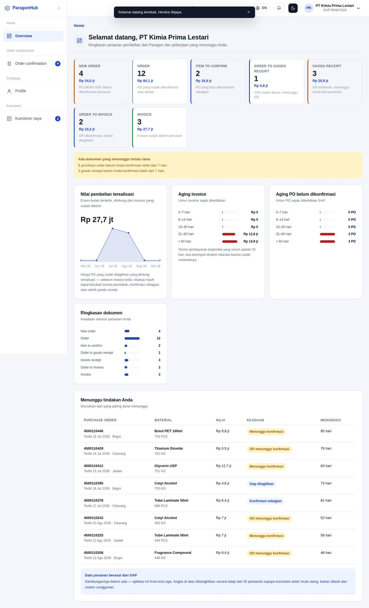
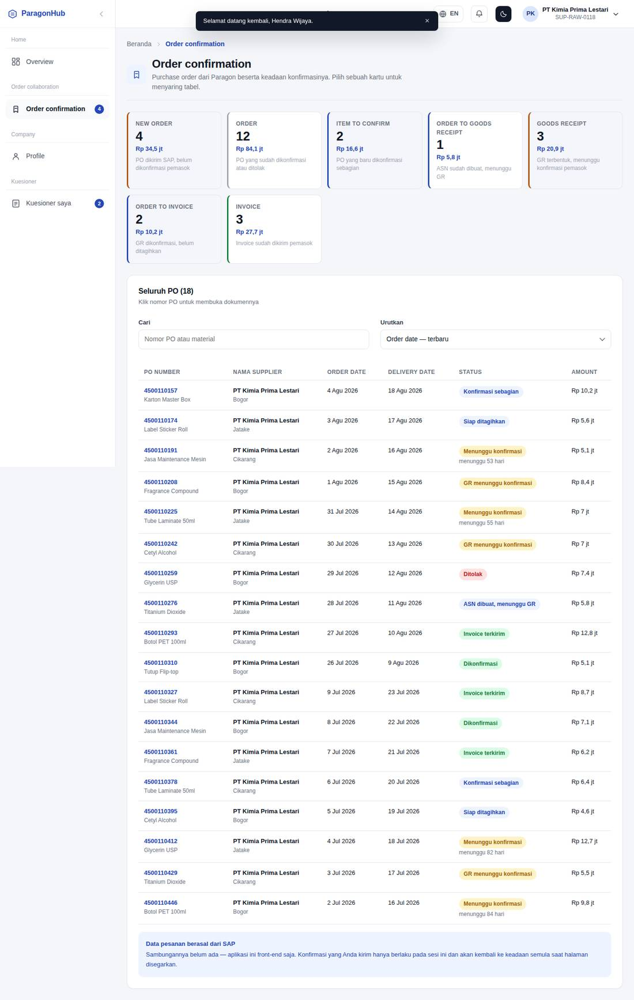
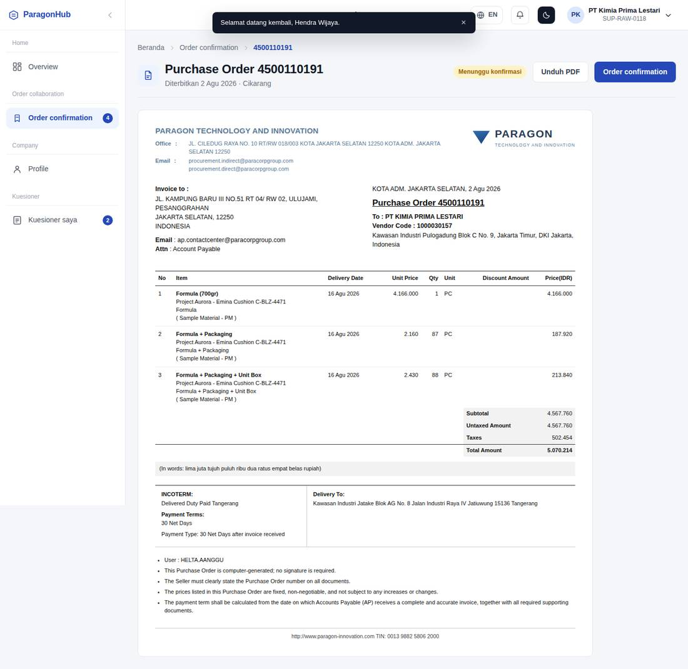
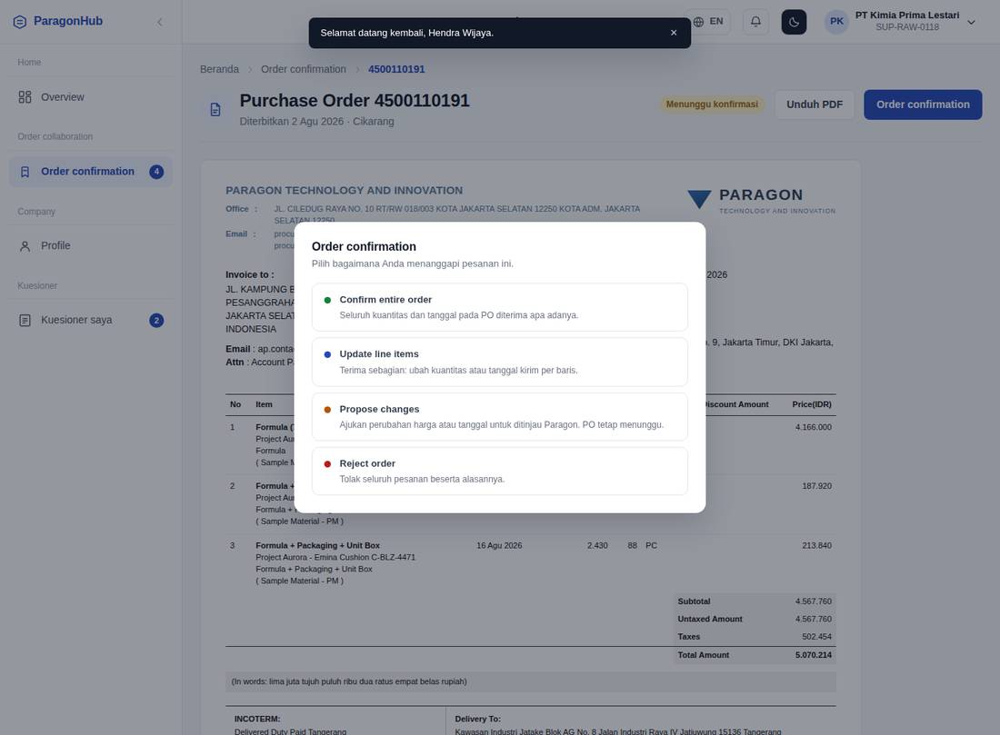
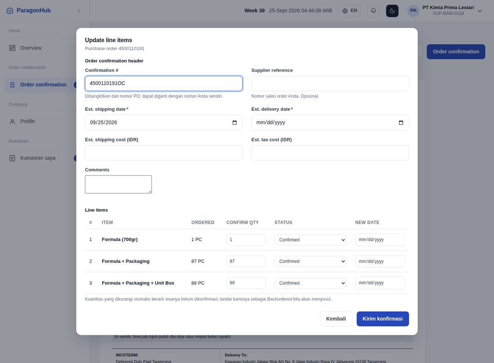
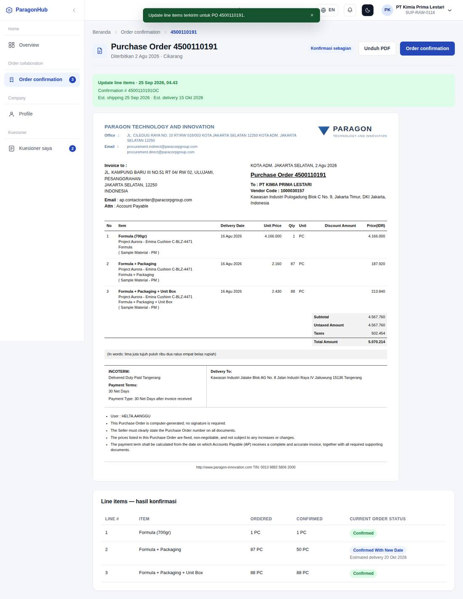
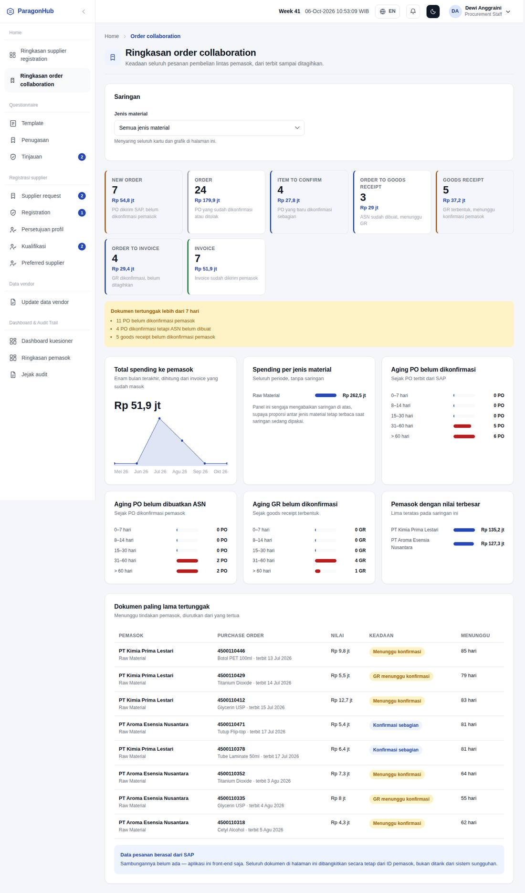

# Paragon Supply Collaboration Hub — Modul Order Collaboration

Dokumen ini melengkapi `README.md`, yang membahas registrasi dan onboarding
pemasok. Yang dibahas di sini adalah bagian **Order Collaboration**: perjalanan
sebuah purchase order dari terbit di SAP sampai ditagihkan pemasok, beserta dua
beranda yang meringkasnya — satu untuk pemasok, satu untuk tim procurement.

Keduanya dipisah karena isinya memang menjawab pertanyaan berbeda dan dibaca
orang berbeda. `README.md` menjelaskan bagaimana pemasok masuk ke sistem;
dokumen ini menjelaskan apa yang terjadi setelahnya.

> Tangkapan layar di dokumen ini diambil langsung dari aplikasi memakai data
> contoh bawaan. Berkas gambarnya ada di `docs/screenshots/`.
>
> ⚠️ **Seluruh dokumen order berasal dari SAP dan sambungannya belum ada.**
> Proyek ini front-end saja. Yang dibangun adalah bentuk datanya, aturan
> pengelompokannya, dan tampilannya — bukan integrasinya. Rinciannya pada
> bagian [Data contoh dan batasnya](#data-contoh-dan-batasnya).

## Daftar isi

Tahapan purchase order · Tujuh kartu tahapan · Beranda portal pemasok ·
Ringkasan order collaboration (internal) · Aturan aging · Struktur berkas ·
Data contoh dan batasnya · Pengujian · Yang belum dibangun

---

## Tahapan purchase order

Satu baris PO berjalan lurus melewati tujuh tahapan. Satu tahapan tambahan,
`Ditolak`, keluar dari alur itu: pemasok menolak dan tidak ada langkah lanjutan.

```
SAP menerbitkan PO
   │
   ▼
Menunggu konfirmasi ──┬──► Ditolak  (keluar dari alur)
   │                  │
   │                  └──► Konfirmasi sebagian ──┐
   ▼                                             │
Dikonfirmasi ◄───────────────────────────────────┘
   │
   ▼
ASN dibuat, menunggu GR
   │
   ▼
GR menunggu konfirmasi pemasok
   │
   ▼
Siap ditagihkan
   │
   ▼
Invoice terkirim
```

| Tahapan | Kode | Artinya |
|---|---|---|
| Menunggu konfirmasi | `new` | PO sudah dikirim SAP, pemasok belum menanggapi |
| Dikonfirmasi | `confirmed` | Pemasok menerima seluruh kuantitas dan tanggalnya |
| Konfirmasi sebagian | `partial` | Pemasok menerima sebagian; sisa kuantitas masih perlu ditanggapi |
| Ditolak | `rejected` | Pemasok menolak |
| ASN dibuat, menunggu GR | `asn_created` | Barang dalam perjalanan |
| GR menunggu konfirmasi | `gr_posted` | GR sudah terbentuk di SAP, menunggu konfirmasi pemasok |
| Siap ditagihkan | `gr_confirmed` | GR dikonfirmasi, invoice belum diterbitkan |
| Invoice terkirim | `invoiced` | Pemasok sudah mengirim invoice |

Definisinya ada pada `PO_STAGE` di `src/orders/orderRules.js`, bersama label dan
nada warnanya.

## Tujuh kartu tahapan

Kedua beranda memakai **kartu yang sama persis**, dibangun dari satu definisi
`ORDER_CARDS`. Ini disengaja: kalau arti "item to confirm" berubah, ia berubah
di kedua beranda sekaligus, sehingga procurement dan pemasok tidak pernah
membaca angka yang artinya berbeda.

| Kartu | Isi | Tahapan yang dihitung |
|---|---|---|
| **New order** | PO dikirim SAP, belum dikonfirmasi pemasok | `new` |
| **Order** | PO yang sudah dikonfirmasi atau ditolak | `confirmed`, `rejected`, `asn_created`, `gr_posted`, `gr_confirmed`, `invoiced` |
| **Item to confirm** | PO yang baru dikonfirmasi sebagian | `partial` |
| **Order to goods receipt** | ASN sudah dibuat, menunggu GR | `asn_created` |
| **Goods receipt** | GR terbentuk, menunggu konfirmasi pemasok | `gr_posted` |
| **Order to invoice** | GR dikonfirmasi, belum ditagihkan | `gr_confirmed` |
| **Invoice** | Invoice sudah dikirim pemasok | `invoiced` |

Tiap kartu menampilkan **jumlah dokumen dan nilai rupiahnya**, bukan hanya
jumlah: sepuluh PO kecil dan sepuluh PO besar menuntut perhatian yang berbeda.

**Satu PO dapat masuk lebih dari satu kartu.** Kartu "Order" sengaja mencakup
seluruh PO yang sudah ditanggapi — termasuk yang sudah melangkah jauh ke
invoice — karena kartu itu menjawab "berapa yang sudah saya tanggapi", bukan
"berapa yang berhenti tepat di tahap konfirmasi". Tanpa aturan itu, sebuah PO
akan menghilang dari "Order" begitu ASN-nya dibuat, dan angkanya justru menyusut
saat pekerjaan berjalan maju.

Kartu yang menuntut tindakan (`actionable`) dan memang ada isinya diberi latar
biru tipis, supaya mata jatuh ke pekerjaan yang menunggu lebih dulu.

## Beranda portal pemasok

`/portal/beranda` — kini menjadi halaman pendaratan pemasok aktif setelah masuk,
menggantikan Profil. Pekerjaan hariannya ada di sini; profil hanya dibuka saat
ada yang perlu diperbarui.

Susunannya mengikuti tiga pertanyaan berurutan yang selalu ditanyakan pemasok:

**1. Apa yang menunggu saya hari ini?** Ketujuh kartu tahapan, diikuti peringatan
kuning bila ada PO atau GR yang menggantung lebih dari tujuh hari.

**2. Berapa yang sudah saya terima?** Kartu *Nilai pembelian terealisasi* —
total beserta grafik garis enam bulan terakhir. Hanya PO yang **sudah
ditagihkan** yang dihitung terealisasi: sebelum invoice terbit, nilainya masih
dapat berubah karena penolakan, konfirmasi sebagian, atau selisih GR.

**3. Mana yang sudah terlalu lama menggantung?**

| Panel | Isi |
|---|---|
| Aging invoice | Umur invoice sejak diterbitkan, dalam rupiah |
| Aging PO belum dikonfirmasi | Umur PO sejak terbit dari SAP, dalam jumlah dokumen |
| Ringkasan dokumen | Jumlah dokumen per tahapan |
| Menunggu tindakan Anda | Delapan dokumen tertua yang menuntut tindakan pemasok |

Pemasok yang belum punya PO sama sekali melihat keadaan kosong yang menjelaskan
kapan pesanan akan muncul — bukan tujuh kartu bernilai nol, yang terbaca seperti
kerusakan.




*Beranda pemasok — tujuh kartu tahapan, nilai terealisasi, aging, dan antrean yang menunggu tindakan*

## Order confirmation (portal pemasok)

Kelompok menu **Order collaboration** pada portal pemasok berisi halaman
**Order confirmation** (`/portal/order-confirmation`), tempat pemasok
menanggapi purchase order dari Paragon.

### Daftar PO

Kepala halaman memakai ketujuh kartu tahapan yang sama dengan beranda, tetapi
di sini kartunya **berfungsi ganda sebagai saringan**: menekan sebuah kartu
menyaring tabel di bawahnya, menekannya lagi melepas saringan. Menaruh
saringan terpisah dari kartu yang angkanya persis sama hanya membuat pengguna
menebak apakah keduanya menghitung hal yang berbeda.

Tabelnya memuat **PO number · Nama supplier · Order date · Delivery date ·
Status · Amount**, dengan pencarian dan pengurutan. *Delivery date* diambil
dari tanggal kirim terawal di antara baris itemnya — sebuah PO dapat memuat
beberapa tanggal, dan yang paling awal itulah yang menentukan kapan pemasok
harus mulai bergerak.

Nomor PO dapat diklik dan membuka dokumennya.

### Dokumen purchase order

`/portal/order-confirmation/:poId` menampilkan PO dalam **bentuk dokumen yang
sama dengan yang diterima pemasok lewat email**: kop Paragon, blok
"Invoice to" dan "To", tabel item beserta harga satuan dan kuantitas, blok
Subtotal/Untaxed/Taxes/Total, baris terbilang, lalu INCOTERM, termin
pembayaran, dan alamat pengiriman.

Bentuk itu sengaja ditiru, bukan diganti tata letak aplikasi sendiri: pemasok
yang mencocokkan PO di portal dengan PO di emailnya tidak perlu menerjemahkan
dua tampilan yang berbeda.

**Unduh PDF** memakai dialog cetak peramban (`window.print()`) beserta gaya
`@media print` yang menyembunyikan kerangka aplikasi. Pustaka PDF sengaja
tidak dipakai: dokumen ini sudah berupa HTML yang tata letaknya persis seperti
yang diinginkan, dan menambah pustaka berarti menulis ulang tata letak yang
sama untuk kedua kalinya — dua salinan yang pasti menyimpang seiring waktu.
Konsekuensinya, hasil unduhan bergantung pada dialog cetak peramban, dan
pengguna memilih "Save as PDF" di sana.

### Empat keputusan konfirmasi

Tombol **Order confirmation** adalah **dropdown**, bukan dialog bertingkat:
keempat pilihan beserta keterangannya muncul langsung di bawah tombolnya, lalu
formulir yang dipilih terbuka sekali saja. Dialog yang isinya hanya empat
tombol menambah satu lapis tanpa menambah keterangan apa pun.

| Keputusan | Isinya | Tahapan PO setelahnya |
|---|---|---|
| **Confirm entire order** | Header konfirmasi saja | `Confirmed` |
| **Update line items** | Tabel baris: kuantitas, tanggal kirim, tanggal terima | **Dihitung dari barisnya** |
| **Propose changes** | Tabel baris: kuantitas, harga, tanggal kirim | **Tetap `Pending confirmation`** |
| **Reject order** | Alasan penolakan | `Rejected` |

**Tanggal pindah ke baris, bukan header.** Pada *update line items* estimasi
tanggal kirim dan terima diisi per baris, karena satu PO dapat memuat material
yang jadwalnya berbeda — satu tanggal di header memaksa pemasok memberi janji
yang tidak akurat untuk sebagian barisnya.

**Status baris tidak lagi dipilih, melainkan diturunkan dari kuantitas** lewat
`lineStatusFor()`: nol berarti *Rejected*, penuh berarti *Confirmed*, di
antaranya *Confirmed partial*. Membiarkan pemasok memilih status sekaligus
mengetik kuantitas membuka peluang keduanya bertentangan, misalnya "Confirmed"
dengan kuantitas nol.

Tahapan PO pada *update line items* juga dihitung dari gabungan barisnya
(`stageFromLines()`): seluruhnya nol berarti PO ditolak, seluruhnya penuh
berarti dikonfirmasi, sisanya konfirmasi sebagian.

**Propose changes tidak memakai header sama sekali.** Yang diusulkan adalah
isi barisnya — kuantitas, harga satuan, dan tanggal kirim — bukan janji
pengiriman, sehingga bidang header tidak punya arti di sana.

**Kuantitas dan harga diketik sebagai teks, bukan `input type="number"`.**
Menyimpannya sebagai angka memaksa tiap ketikan melewati `Number()`, sehingga
"1" sempat menjadi `1`, dirender ulang, dan kursor melompat ke awal. Nilainya
dibiarkan apa adanya selama mengetik dan baru ditafsirkan saat divalidasi.

**Usulan perubahan sengaja tidak memindahkan tahapan.** Mengusulkan bukan
berarti disetujui; PO tetap menunggu sampai Paragon menanggapi dan pemasok
mengonfirmasi versi terbarunya. Aturannya ada pada `stageAfterConfirmation()`
dan diuji terpisah.

Header konfirmasinya mengikuti portal pemasok yang lazim: Confirmation #,
Supplier reference, Est. shipping date, Est. delivery date, Est. shipping
cost, Est. tax cost, dan Comments. **Confirmation # dibangkitkan dari nomor
PO** dengan akhiran `OC` (`confirmationNumberFor()`), sehingga pemasok tidak
perlu mencatat dua nomor berbeda — tetapi tetap dapat menggantinya dengan
nomor sales order sendiri.

Keadaan tiap baris mengikuti istilah yang sama: *Confirmed*, *Confirmed With
New Date*, *Confirmed Partial*, *Backordered*, *Rejected*. Kolom tanggal baru
hanya aktif bila keadaannya *Confirmed With New Date* — tanggal baru pada
baris yang dikonfirmasi apa adanya tidak berarti apa-apa.

**Validasi yang berlaku:**

- *Confirm entire order*: estimasi tanggal kirim dan terima wajib diisi.
- *Update line items*: tiap baris berkuantitas di atas nol wajib punya kedua
  tanggalnya, dan kuantitas tidak boleh melebihi yang dipesan.
- Tanggal terima tidak boleh mendahului tanggal kirim, di header maupun baris.
- *Propose changes*: setidaknya satu baris harus benar-benar berubah, dan tiap
  baris wajib punya kuantitas, harga, serta tanggal.
- Penolakan dan usulan perubahan wajib beralasan, minimal 15 karakter.

## Tinjauan konfirmasi (konsol internal)

`/internal/konfirmasi-pemasok` menampilkan apa yang dikirim pemasok atas tiap
purchase order.

**Tiga dari empat jenis konfirmasi bersifat baca saja.** Menerima, menerima
sebagian, atau menolak pesanan adalah hak pemasok; procurement tidak
menyetujui keputusan itu, hanya melihatnya. Layarnya menyatakan hal itu secara
terbuka lewat penanda "View only", bukan dengan tombol mati tanpa keterangan.

**Yang menuntut keputusan hanyalah *propose changes*,** karena usulan harga,
kuantitas, atau tanggal mengubah isi PO dan karenanya harus disepakati. Tabel
usulannya menampilkan nilai lama dan usulan berdampingan — yang lama dicoret,
yang baru ditebalkan — dan hanya baris yang benar-benar berubah yang diberi
latar; baris lain ditandai *unchanged* supaya procurement tidak perlu
membandingkan sendiri kolom demi kolom.

| Keputusan | Tahapan PO | Muncul di kartu |
|---|---|---|
| **Decline changes** | `Changes rejected` | **New order** — pemasok harus menanggapi lagi |
| **Approve changes** | `Changes approved` | **Order** |

Penolakan wajib beralasan; persetujuan boleh tanpa catatan.

### Sync setelah persetujuan

Menyetujui usulan **tidak langsung mengubah PO**. Alur sesungguhnya: procurement
memperbarui PO di SAP, lalu versi terbarunya ditarik kembali ke aplikasi. Karena
itu persetujuan hanya memunculkan tombol **Sync this PO from SAP** pada halaman
PO pemasok.

Sync berlaku **untuk satu PO saja**, bukan seluruhnya: pembaruan massal akan
menimpa PO lain yang sedang ditanggapi pemasok. Setelah ditarik, kuantitas,
harga, dan tanggal baris mengikuti usulan yang disetujui, dan subtotal, pajak,
serta total PO dihitung ulang.

⚠️ Tanpa backend, "menarik dari SAP" berarti menerapkan nilai usulan yang
disetujui langsung ke barisnya — itulah yang akan dikembalikan SAP setelah
procurement memperbaruinya di sana.

⚠️ Konfirmasi hanya hidup di memori. Pada sistem sungguhan ia dikirim balik ke
SAP; di sini keadaannya kembali semula saat halaman disegarkan.




*Daftar PO — kartu tahapan berfungsi sebagai saringan tabel di bawahnya*



*Dokumen PO, tata letaknya meniru PO Paragon yang diterima pemasok lewat email*



*Langkah pertama dialog: empat keputusan beserta keterangan singkatnya*



*Update line items — header konfirmasi di atas, baris item dengan kuantitas, status, dan tanggal baru*



*Setelah konfirmasi terkirim: status PO berpindah dan ringkasannya muncul di atas dokumen*

## Ringkasan order collaboration (internal)

`/internal/order-collaboration` — ringkasan kedua pada kelompok **Beranda**.
Ringkasan yang sudah ada diberi nama tegas **"Ringkasan supplier registration"**,
karena sejak ada ringkasan kedua, sebutan "Ringkasan" saja tidak lagi memberi
tahu ringkasan yang mana.

Kartunya sama persis dengan beranda pemasok, tetapi mencakup **seluruh pemasok**.
Yang ditambahkan adalah sisi Paragon:

| Panel | Isi |
|---|---|
| **Saringan jenis material** | Raw Material · Packaging Material · Indirect Material, menyaring seluruh kartu dan grafik |
| Total spending ke pemasok | Nilai beserta grafik garis enam bulan |
| Spending per jenis material | Proporsi antar jenis material |
| Aging PO belum dikonfirmasi | Sejak PO terbit dari SAP |
| Aging PO belum dibuatkan ASN | Sejak PO dikonfirmasi pemasok |
| Aging GR belum dikonfirmasi | Sejak goods receipt terbentuk |
| Pemasok dengan nilai terbesar | Lima teratas pada saringan yang sedang dipakai |
| Dokumen paling lama tertunggak | Delapan dokumen tertua yang menunggu tindakan pemasok |

**Panel "Spending per jenis material" sengaja mengabaikan saringan di atasnya.**
Menyaring ke satu jenis material lalu menampilkan grafik proporsi antar jenis
material akan selalu menghasilkan satu batang penuh — tidak memberi tahu apa
pun. Dibiarkan penuh, panel itu tetap berguna sebagai pembanding saat saringan
sedang dipakai.

### Tiga aging, tiga titik awal berbeda

Ketiga aging dihitung dari **tanggal langkah sebelumnya**, bukan dari tanggal PO.
Sebuah PO yang terbit 60 hari lalu tetapi GR-nya baru terbentuk kemarin bukan
masalah GR; mengukurnya dari tanggal PO akan menuduh langkah yang salah.

| Aging | Dihitung sejak |
|---|---|
| PO belum dikonfirmasi | `orderedAt` — PO terbit dari SAP |
| PO belum dibuatkan ASN | `confirmedAt` — pemasok mengonfirmasi |
| GR belum dikonfirmasi | `grPostedAt` — GR terbentuk di SAP |




*Ringkasan internal — kartu yang sama lintas pemasok, saringan jenis material, tiga aging, dan dokumen tertunggak*

## Bahasa status

Seluruh status pada modul Order Collaboration ditulis dalam **bahasa Inggris** —
`Pending confirmation`, `Partially confirmed`, `GR awaiting confirmation`,
`Changes approved`, dan seterusnya — mengikuti istilah yang dipakai portal
pemasok dan SAP.

Alasannya dua: pemasok lintas negara membaca layar yang sama, dan istilah
seperti *goods receipt* atau *backordered* memang tidak punya padanan Indonesia
yang lazim di lingkungan procurement. Bagian aplikasi lain — registrasi,
kualifikasi, kuesioner — tetap berbahasa Indonesia, karena pembacanya tim
Paragon sendiri.

Sebuah pemeriksaan (`E1`–`E4` pada `orders-check.mjs`) menjaga agar label
tahapan, keadaan baris, dan keterangan kartu tidak diam-diam kembali ke bahasa
Indonesia.

## Aturan aging

Ember umurnya sama untuk seluruh grafik aging, didefinisikan sekali pada
`AGING_BUCKETS`:

| Ember | Rentang |
|---|---|
| 0–7 hari | Baru; belum perlu diperingatkan |
| 8–14 hari | Mulai tertahan |
| 15–30 hari | Perlu ditindaklanjuti |
| **31–60 hari** | Melewati termin terpendek — ditandai merah |
| **> 60 hari** | Tertunggak jauh — ditandai merah |

Batas 30 hari dipilih agar sejalan dengan termin pembayaran yang dipakai bagian
Pembayaran & Tagihan (7/14/30/45/60/90/120 hari): apa pun yang melewatinya sudah
melewati termin terpendek yang umum dipakai.

Ambang "tertunggak" untuk peringatan kuning adalah **tujuh hari**
(`OVERDUE_DAYS`), dan dihitung **di atas** ambang itu — dokumen yang tepat
berumur tujuh hari belum dianggap tertunggak.

## Struktur berkas

```
src/orders/
  orderRules.js        PO_STAGE, ORDER_CARDS, AGING_BUCKETS,
                       summariseOrderCards, bucketByAge, daysSince,
                       overdueItems, realisedByMonth, spendByMaterialType,
                       topSuppliers, totalValue   (murni, tanpa React)
  orderMockData.js     PURCHASE_ORDERS, ordersOf  (pengganti data SAP)
  components/
    OrderVisuals.jsx   OrderCardGrid, BarChart, LineChart, formatIdr
    orders.css         kartu, grafik, tabel dokumen
  store/
    OrderStore.jsx       purchase order + keadaan konfirmasi (di memori)
  pages/
    SupplierOrderHome.jsx          beranda portal pemasok
    SupplierOrderConfirmation.jsx  daftar PO + saringan kartu
    PurchaseOrderDetail.jsx        dokumen PO, unduh PDF, konfirmasi
    OrderCollaborationSummary.jsx  ringkasan konsol internal
    po-document.css                tata letak dokumen + aturan cetak
  components/
    OrderConfirmationDialog.jsx    dialog empat keputusan

scripts/
  orders-check.mjs     35 pemeriksaan aturan murni
```

Lapisan aturannya sengaja bebas React, mengikuti pola `profileRules.js`,
`qualificationRules.js`, dan `sapRules.js` yang sudah dipakai di modul lain:
yang menghitung tinggal di satu berkas yang dapat diuji langsung, sedangkan
halaman hanya menampilkan hasilnya.

Grafiknya digambar dengan **SVG sendiri, tanpa pustaka grafik tambahan** —
mengikuti keputusan yang sudah dipakai pada dashboard kuesioner. Setiap grafik
disertai tabel angka tersembunyi (`.visually-hidden`) supaya terbaca pembaca
layar, karena SVG sendiri tidak mengumumkan nilainya.

### Format rupiah

`formatIdr()` menyingkat sendiri menjadi `jt` dan `mlr`, tidak memakai compact
notation bawaan `Intl`. Notasi itu memendekkan miliar menjadi **"M"**, yang di
sebuah kartu berisi angka rupiah terlalu mudah terbaca sebagai "juta" —
`Rp 1 M` bisa berarti satu juta atau satu miliar. `Rp 1 mlr` tidak punya
masalah itu.

## Data contoh dan batasnya

⚠️ Pada sistem sungguhan seluruh dokumen ini datang dari SAP. Karena proyek ini
tanpa server, baris PO dibangkitkan `orderMockData.js` secara **deterministik**
dari ID pemasok dan nomor urutnya — hash sederhana, bukan `Math.random()`.

Alasannya praktis, sama dengan `sap/purchaseOrders.js`: angka yang berubah tiap
render membuat kartu beranda berkedip, grafik bergeser, dan saringan tidak dapat
dipercaya saat menelusuri demo.

Dua hal yang perlu diketahui tentang bentuk data contohnya:

**Jumlah PO per pemasok sengaja besar (9–20).** Hanya sedikit pemasok contoh
yang tuntas registrasinya, dan dengan PO yang sedikit sebagian tahapan selalu
kosong — kartu yang selalu nol tidak dapat ditelusuri. Sebuah pemeriksaan
(`D8`) menjaga agar ketujuh kartu benar-benar terisi.

**Tahapan diambil dengan melangkahi kolam sejauh 13 tiap baris**, bukan lewat
hash langsung. 13 dan panjang kolam (28) tidak punya faktor persekutuan,
sehingga satu pemasok menyentuh banyak tahapan berbeda. Memakai hash saja —
percobaan pertama — menyisakan dua tahapan kosong karena sebarannya tidak rata.

Tanggal tiap langkah diturunkan mundur dari tanggal PO, sehingga umurnya masuk
akal: sebuah GR tidak pernah lebih tua daripada PO-nya. Pemeriksaan `D5`
menjaga aturan itu.

Satu berkas — `orderMockData.js` — yang perlu diganti ketika integrasi SAP
tersedia. `orderRules.js` tidak perlu disentuh.

## Pengujian

```bash
npm test     # menjalankan seluruh rangkaian, termasuk orders-check.mjs
```

`scripts/orders-check.mjs` memuat 35 pemeriksaan pada empat kelompok:

| Kelompok | Yang diperiksa |
|---|---|
| `C1`–`C11` | Kartu tahapan: urutan, isi tiap kartu, penjumlahan nilai, kartu kosong |
| `A1`–`A9` | Umur dan aging: pembulatan hari, tanggal kosong, tanggal masa depan, batas ember tidak tumpang tindih, ambang tertunggak |
| `R1`–`R7` | Realisasi dan belanja: hanya invoice yang dihitung, pengelompokan jenis material, urutan pemasok |
| `D1`–`D8` | Data contoh: determinisme, tahapan dikenal, tanggal GR tidak mendahului PO, invoice hanya pada tahap invoiced, ketujuh kartu terisi |

Renderingnya diperiksa `render-check.jsx` dan `mdm-render-check.jsx`: beranda
pemasok aktif (ketujuh kartu dan grafiknya), keadaan kosong untuk pemasok yang
belum punya PO, dan ringkasan internal beserta kedua nama ringkasan pada menu.

## Yang belum dibangun

Modul ini baru sebatas **ringkasan**. Yang belum ada:

- **Tindakan pemasok yang tersisa**: membuat ASN, mengonfirmasi GR, dan
  mengirim invoice. Konfirmasi pesanan sudah ada; sisanya menulis ke SAP dan
  menunggu backend.
- **Pemberitahuan.** Pemasok tidak diberi tahu saat usulannya diputuskan;
  ia harus membuka PO-nya sendiri untuk mengetahuinya.
- **Riwayat konfirmasi.** Hanya konfirmasi terakhir yang tersimpan per PO,
  sehingga putaran usulan–penolakan–usulan ulang tidak meninggalkan jejak.
- **Unggahan dokumen** invoice dan faktur pajak.
- **Notifikasi** untuk PO baru dan GR yang menunggu konfirmasi. Kerangkanya
  sudah ada pada modul kuesioner dan dapat dipakai ulang.
- **Terjemahan EN dan ZH** untuk label modul ini; saat ini masih Bahasa
  Indonesia dengan pola fallback yang sudah ada.

### Saran data tambahan untuk tahap berikutnya

Beberapa hal yang layak dipertimbangkan saat modul ini dilanjutkan, tetapi
sengaja **belum dibangun** karena belum ada keputusan bisnisnya:

| Usulan | Kenapa berguna |
|---|---|
| **On-time delivery rate** | Membandingkan tanggal GR dengan tanggal janji pada PO; ukuran performa pemasok yang paling sering diminta |
| **Selisih kuantitas GR vs PO** | Menyorot pengiriman kurang atau lebih sebelum menjadi sengketa invoice |
| **Aging invoice menuju jatuh tempo** | Melengkapi aging yang ada: bukan hanya berapa lama invoice tertahan, tetapi berapa hari lagi Paragon harus membayar |
| **Nilai PO ditolak beserta alasannya** | Penolakan berulang pada satu material menandakan masalah harga atau kapasitas |
| **Lead time rata-rata per tahapan** | Menunjukkan langkah mana yang paling lambat secara sistemik, bukan hanya dokumen mana yang tertunggak |
| **Sebaran per plant** | PO contoh sudah menyimpan `plant` (Jatake, Cikarang, Bogor) tetapi belum ditampilkan di mana pun |

Empat yang pertama menuntut data yang belum ada pada bentuk PO saat ini
(tanggal janji, kuantitas GR aktual, alasan penolakan), jadi menambahkannya
berarti menyepakati bentuk datanya lebih dulu dengan tim SAP.
